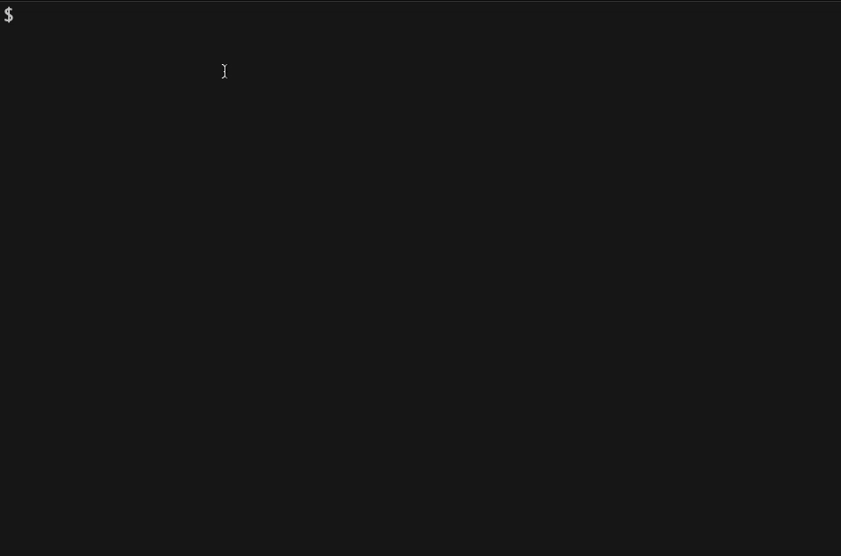

# runrun-cli

[](http://npm.im/runrun-cli)
[](http://opensource.org/licenses/MIT)
[](http://makeapullrequest.com)
[](https://github.com/prettier/prettier)

Delightful interactive npm scripts runner.

## Demo



## Installation

Try it out with `npx`:

```shell
npx runrun-cli
```

Install globally (enables to execute `rr` anywhere in the command line):

```shell
npm install -g runrun-cli
```

## Usage

`rr` looks for a `package.json` with `scripts` defined and lets you
interactively choose which script to run:

```shell
rr
```

For CLI options, use the `-h` (or `--help`) argument:

```shell
rr -h
```

## Contributing

See the [CONTRIBUTING](CONTRIBUTING.md) document.
